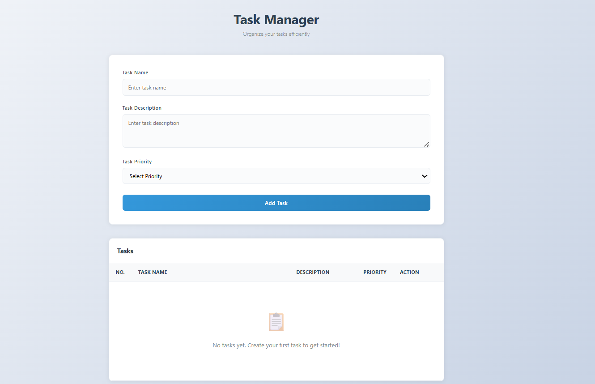

# 📘 API Hunter – Public API Explorer (React.js)

## 📌 Project Description

**API Hunter** is a React.js web application that allows students to explore, fetch, and display data from public APIs.
The main purpose of this project is to understand real-world API consumption, React hooks, state management, and dynamic UI rendering.

The application enables users to:

* 🔎 Search or browse data from an external API
* 📡 View results dynamically
* ⏳ Handle loading states while fetching data
* ⚠️ Display error messages if API fails
* 🎨 See data in a clean and responsive interface

---

## 🎯 Learning Objectives

By completing this project, students will learn:

* How **REST APIs** work
* Fetching data using `fetch()` or `axios`
* React fundamentals:

  * Components
  * Props
  * State
* React Hooks:

  * `useState`
  * `useEffect`
* Conditional rendering
* Handling loading & error states
* Structuring a React project properly

---

## 🧰 Technology Stack

* ⚛️ React.js
* 🟨 JavaScript (ES6+)
* 🌐 HTML5
* 🎨 CSS3
* 📡 Public API

---

## 🌐 API Used

*(Replace with the API you selected)*

Example options:

* OpenWeather API
* Fake Store API
* TheMealDB API
* REST Countries API
* News API
* JSONPlaceholder API

---

## ✨ Features

* API search or browsing functionality
* Dynamic data rendering from API
* Loading indicator while fetching
* Proper error handling UI
* Responsive layout for different screens

---

## 🔐 Environment Variables (If API key required)

Create a `.env` file in the project root:

```
REACT_APP_API_KEY=your_api_key_here
```

Use in React:

```javascript
const apiKey = process.env.REACT_APP_API_KEY;
```

⚠️ Never upload `.env` to GitHub.

---

## 🚀 Installation & Setup

### 1️⃣ Clone the repository

```bash
git clone https://github.com/your-username/api-hunter.git
```

### 2️⃣ Navigate into project folder

```bash
cd api-hunter
```

### 3️⃣ Install dependencies

```bash
npm install
```

### 4️⃣ Start development server

```bash
npm start
```

Application runs on:

```
http://localhost:3000
```

---

## 📂 Suggested Project Structure

```
src/
 ├── components/
 │    ├── SearchBar.js
 │    ├── ApiCard.js
 │    └── Loader.js
 ├── services/
 │    └── api.js
 ├── App.js
 ├── index.js
 └── styles.css
```

---

## 📸 Screenshots



---

## 🔮 Future Improvements

* Pagination support
* Dark/light theme toggle
* Favorites/bookmark feature
* Multiple API integration
* Filtering and sorting options


## 👨‍💻 Author


**Sahil Nerpagar**


---

## 📜 License

This project is created for **educational** purposes only.
